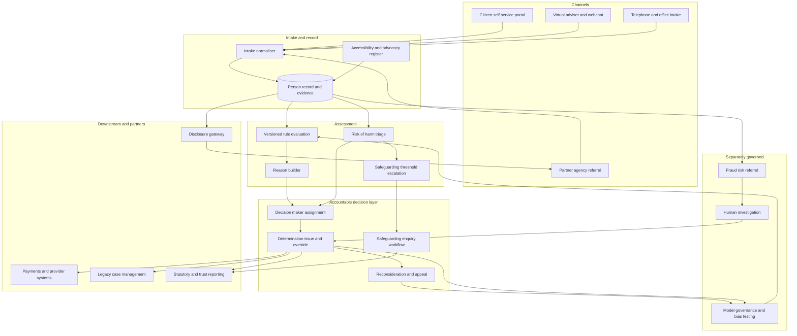

# Casewarden

**Source:** `ai-in-hr/Accenture-ai-in-social-Services-POV-FINAL/`
**Domain:** `ai-hr`
**One-liner:** A statutory casework triage and determination record for human services agencies that grades every case on risk of harm and entitlement error, routes standard determinations to automated assessment under a named accountable decision-maker, and keeps reasons, appeal rights and cross-agency disclosure defensible at tribunal.
**Wedge:** Adult social care and working-age benefit teams in a single jurisdiction — a UK unitary authority, a Nordic municipality, or one regional office of a national agency — with 150–1,500 caseworkers, starting with the eligibility and entitlement stage plus the duty-desk safeguarding queue.
**Positioning:** Casework triage with due process built in. The market is selling citizen-facing virtual advisers; the channel is the easy part. The defensible object is the determination record — what was decided, on what facts, by whom, with which reasons, under which lawful basis for the data used — because that record is what a mandatory reconsideration, a tribunal, an ombudsman investigation and a safeguarding adults review all demand.

## Market research synthesis

### Thesis from source

The source argues that human services agencies are being squeezed from two directions at once and that AI is the only lever that moves both. On the demand side, citizens now expect the same digital service from government that they get from commercial businesses, and the document reports that more than three-quarters of public service executives see AI emerging as the new user interface, eight in ten say it is important to offer services through centralised platforms, assistants or messaging bots, and more than nine in ten say it is critical to adopt a platform-based business model to engage in ecosystems with digital partners. On the supply side the money is going the other way: the document cites the Institute for Fiscal Studies finding that between 2010 and 2017 local authority spending on social care per adult in the UK fell by 13.5%. It also names inflexible service models that prevent a holistic view of the customer, complex ecosystems that make it hard to source data and specialist services across partners, and the skills and organisational adaptation burden of adopting the technology at speed.

Its prescription is structured rather than rhetorical. Agencies should enable intelligent processes that improve service delivery speed, provide insight-driven services that optimise decision-making *and accountability*, and offer proactive and personalised support at key moments in citizens' lives. It maps the technology onto a sense–comprehend–act–learn spine and the organisation onto four layers: customer and channels management, service delivery across the registration and application, eligibility and entitlement, service delivery and performance management value chain, back-office functions, and — explicitly first in its own diagram — policy, administration and management, where the job is to "build new AI governance models to establish and manage AI and define digital trust protocols." The workforce claim is precise and is the kernel of the product: "case workers work alongside virtual advisers to automate standard case management and direct efforts on discovering and addressing high-risk cases," with AI providing the opportunity to reskill workers away from routine tasks.

The document backs this with measured deployments rather than promises. A large European government agency's digital assistant improved service speed by 30% and enabled automated handling of suitable email, webchat and telephone interactions. A large European pensions agency's robotics solution reduced user set-up times in CRM by 100% and changes to user set-up by 200%. A North American human services agency using machine learning and NLP is poised for annual savings of more than 300,000 employee hours in processing public comments on regulations. A European land registry using deep learning and computer vision compared property records against aerial imagery at roughly 80% accuracy. It also names a predictive service-delivery model that estimates fraud risk as an example use case, and sketches a three-era trajectory — support, enablement, empowerment — in which services move from reactive and segmented, through proactive and self-managed, to a platform-based cross-agency ecosystem where the agency orchestrates.

Two things in that account define the commercial opportunity and one defines the risk. First, the highest-value automation target is not the chat window; it is the determination of eligibility and entitlement, which is high-volume, rule-bound, and the largest source of both delay and error. Second, the stated purpose of the freed capacity is to concentrate caseworkers on discovering and addressing high-risk cases, which means triage on risk of harm has to be as good as the determination engine, or the freed hours land on the wrong doorsteps. The risk is what the source itself flags when it puts AI governance and digital trust protocols in the first box: an automated determination that a person is not entitled, or a fraud-risk score that suspends a payment, is an administrative decision against a vulnerable person, and jurisdictions that have learned this the hard way now require a named human decision-maker, disclosed reasons, and a real route of appeal. Casewarden is built as if that requirement is the product rather than a constraint on it.

### Buyer & economic model

- **Primary buyer:** the Director of Adult Social Services or Director of Benefit Operations, with the agency's transformation director or COO as economic buyer because the business case is written against the funding squeeze the source quantifies.
- **Users:** caseworkers and assessors (daily), duty-desk and safeguarding leads (daily triage), eligibility and appeals officers (determinations and reconsiderations), information governance and Caldicott-equivalent officers (lawful basis and disclosure), partner agency liaisons in health, housing, policing and education, model governance reviewers, performance and finance analysts, and citizens and their carers or advocates through the self-service and appeal surfaces.
- **Budget owner / value metric:** the agency's operating budget plus transformation or invest-to-save funding. The value metric is cost per determination and caseworker hours redirected from standard case administration to high-risk casework; the quality metrics that gate it are the overturned-appeal rate on the automated path and time to first contact after a risk signal.
- **Competing status quo:** a legacy case management system of record, spreadsheet RAG-rated caseload lists, duty triage performed by whoever answers the phone, a multi-agency safeguarding hub coordinating by telephone and email, a separate fraud team with its own rules engine, and statutory performance returns compiled by hand at the end of each quarter.

### Domain constraints

- **Regulatory / trust / safety:** eligibility and entitlement are creatures of statute and guidance, so an automated determination must be traceable to the rule version it applied. Most European jurisdictions restrict solely automated decisions producing legal effects, which makes a named accountable human decision-maker a design requirement rather than a policy preference. Citizens have a right to reasons sufficient to challenge a decision, a mandatory reconsideration route, and onward appeal to a tribunal. Safeguarding duties are statutory and time-bound: a concern crossing the threshold triggers an enquiry with defined responsibilities, and a triage model that de-prioritises a case cannot extinguish that duty. Fraud-risk scoring carries the heaviest political and legal risk in the whole domain, and recent European experience with risk-indication systems and automated benefit-fraud detection has established that opaque profiling of claimants is both unlawful and institutionally catastrophic.
- **Data sensitivity:** casework data is special-category by default — health, disability, ethnicity, sexual orientation, criminal justice involvement, children's records. Mental capacity affects whether consent is a valid basis at all, so lawful basis is per-purpose and per-disclosure rather than a single account-level flag. Cross-agency sharing requires a recorded agreement, purpose and legal gateway, and recipients must be prevented from inheriting wider access than the gateway allows. Retention is long and uneven: children's social care records are retained for decades in several jurisdictions, while fraud-investigation material may be subject to shorter and different rules.
- **Change-management realities:** caseworkers have seen "computer says no" before and will route around a system they distrust, so the determination engine must show its reasoning and accept a documented override. Partner agencies will not replace their own systems, so integration must be by controlled disclosure rather than migration. Unions and professional bodies will treat triage scoring as a change to professional practice. And the source's own era model matters commercially: the product must produce measurable value in era-of-support conditions — reactive, segmented services on legacy data — because no agency will fund a platform that only pays off once it reaches the era of empowerment.

## Business requirements

- BR-1: No determination with legal effect on a person's entitlement or service may be issued without a named accountable human decision-maker recorded against it, regardless of how much of the assessment was produced automatically.
- BR-2: Every determination must carry machine-readable reasons — the facts relied on, the rule version applied, the evidence gaps, and the consequence — sufficient to support a mandatory reconsideration and to be assembled into a tribunal bundle without reconstruction.
- BR-3: Caseload triage must be calibrated on risk of harm and statutory duty rather than on cost or processing convenience, and any case whose facts cross a safeguarding threshold must be escalated irrespective of its triage score.
- BR-4: Automated assessment may only be applied to determination types that have been formally classified as standard, with a documented rule basis, a measured accuracy and overturn baseline, and a scheduled re-review; any determination type whose overturn rate breaches its threshold must revert to full human assessment automatically.
- BR-5: Fraud-risk scoring must be governed separately from eligibility, must never by itself suspend or reduce a payment, must be bias-tested by protected characteristic on a published schedule, and must be disclosable to the affected person on request in terms they can contest.
- BR-6: Proactive outreach at life events must be opt-out-able by the citizen, must not create covert monitoring of people who have not sought a service, and must record the signal that prompted it so that a person can ask why they were contacted.
- BR-7: Cross-agency information sharing must be blocked unless a recorded agreement, legal gateway and purpose exist for that specific disclosure, and every disclosure must be logged at field level for later subject-access and audit response.
- BR-8: The platform must accommodate capacity, advocacy and accessibility needs as first-class case attributes — appointed advocate, interpreter, easy-read format, trusted third party — and must not route a person away from human contact on efficiency grounds where such a need is recorded.
- BR-9: The agency must be able to evidence a measurable improvement in service speed against a stated baseline, in the class of the 30% improvement the source reports, and a measurable reduction in caseworker hours spent on standard case administration.
- BR-10: Caseworker overrides of automated assessment must be recorded with reasons, must be reported as a quality signal on the model rather than as a performance issue for the worker, and must feed the re-review of that determination type.
- BR-11: The agency must operate a published AI governance model covering model inventory, approval, monitoring and withdrawal, with a digital trust statement available to citizens describing where automation is used in their case.
- BR-12: Records must be retained under the statutory schedule applicable to each record class, with an append-only history of determinations, risk gradings, disclosures and appeals, and with retention differences between adult, child and fraud material enforced by the system.

## User stories

Canonical user stories live in sibling [USER_STORIES.md](USER_STORIES.md).

## System design

### Overview

Casewarden sits between the agency's channels and its legacy case management system of record. Intake arrives from a self-service portal, a virtual adviser, webchat, telephone notes or a partner referral, and is normalised into a person record with circumstances and evidence. Two engines then run in parallel on that record. The determination engine evaluates eligibility and entitlement against a versioned rule set and produces either an issued decision, where the determination type is classified as standard and a human decision-maker has been assigned, or a prepared recommendation with reasons for a caseworker to complete. The triage engine grades risk of harm and entitlement-error exposure and allocates the case against caseworker capacity, with statutory thresholds implemented as hard escalations that bypass the score. Everything either engine produces is written to an append-only determination and grading history with its rule version, evidence set and lawful basis. Appeals, overrides, disclosures and proactive outreach all read from and write to that history, which is also the source for statutory performance reporting and for model monitoring.

### Actors & boundaries

- **Actors:** citizen and carer, advocate or appointee, caseworker, duty-desk and safeguarding lead, eligibility officer, appeals officer, fraud investigator, information governance officer, model governance reviewer, partner agency (health, housing, police, education, employment service), performance and finance analyst.
- **Trust boundary:** the person record is the protected core. Access is per-purpose rather than per-user: a fraud investigator sees investigation-scoped fields, a partner agency sees only the fields its gateway permits, and the virtual adviser operates on a minimal projection with no access to safeguarding narrative. Automated assessment can read the record and write recommendations, but issuing a decision with legal effect requires the assigned human decision-maker's action. Fraud-risk scores are held outside the eligibility determination path so that a score cannot leak into an entitlement decision without an explicit, logged investigative step.
- **Human-in-the-loop points:** assignment and action of the accountable decision-maker on every determination; caseworker override with reasons; safeguarding threshold judgement; disclosure approval outside a standing gateway; fraud investigation before any payment action; reconsideration and appeal decisions; model approval, monitoring review and withdrawal.

### Core capabilities

1. **Omni-channel intake and circumstance capture** — portal, virtual adviser, webchat, telephone and partner referral normalised into a person record with evidence attachments and accessibility needs.
2. **Eligibility and entitlement determination** — versioned rule evaluation producing issued decisions or prepared recommendations, always with structured reasons.
3. **Risk-of-harm triage and caseload allocation** — grading and allocation against caseworker capacity and statutory deadlines, with threshold-driven hard escalation.
4. **Safeguarding enquiry workflow** — duty tracking, enquiry stages, multi-agency participation, and closure with outcome.
5. **Proactive life-event intervention** — signal-driven support offers with opt-out, purpose recording and a citizen-visible explanation of why contact was made.
6. **Appeals, reconsideration and bundle assembly** — statutory deadlines, evidence assembly, outcome recording, and overturn analytics per determination type and rule version.
7. **Cross-agency information sharing** — gateway-gated disclosure requests, field-level logging, and standing agreement management.
8. **Fraud-risk review, separately governed** — scored referrals to investigation with mandatory human investigation before any payment action, plus bias testing.
9. **Model governance** — model inventory, classification of determination types, accuracy and overturn thresholds, automatic reversion to human assessment, and withdrawal.
10. **Performance, funding and trust reporting** — statutory returns, service speed against baseline, caseworker hour reallocation, and a public digital trust statement.

### Conceptual data

- **Primary entities:** PersonRecord, Circumstance, LifeEventSignal, Application, EvidenceItem, DeterminationType, RuleVersion, Determination, DeterminationReason, OverrideRecord, RiskAssessment, SafeguardingEnquiry, CaseAssignment, CaseworkerCapacity, InterventionOffer, Appeal, LawfulBasisRecord, InformationSharingAgreement, DisclosureRequest, DisclosureLogEntry, FraudRiskReferral, ModelVersion, BiasTest, AccessibilityNeed, AdvocateAuthority.
- **Critical events:** application received; evidence supplied or found deficient; determination prepared, issued or overridden; risk graded or re-graded; safeguarding threshold crossed and enquiry opened or closed; case assigned or reallocated; intervention offered, accepted, declined or opted out; appeal lodged, reconsidered and decided; disclosure requested, granted or refused; fraud referral raised and investigated; model approved, breached threshold, reverted or withdrawn.
- **Retention / audit needs:** append-only history of determinations, gradings, overrides, disclosures and appeals for the statutory retention period of each record class, with children's social care material held on its own long schedule and fraud-investigation material segregated. Model versions, thresholds and bias tests retained for the life of every decision they influenced, because a decision cannot be explained years later without the rule and model state that produced it.

### Integrations (conceptual)

- **Systems of record:** the legacy social care or benefits case management system, the payments and finance system, the document and evidence repository, and the corporate identity and access directory.
- **Upstream signals:** citizen self-service and virtual adviser channels, partner referrals from health, housing, policing, education and employment services, national identity and income verification services where a gateway exists, and life-event notifications such as bereavement, hospital discharge, tenancy change or loss of employment.
- **Downstream actions:** determination notices and reason statements to the citizen, payment or service instructions to the finance and provider systems, safeguarding enquiry tasks to the responsible team, disclosure packages to partner agencies within gateway limits, appeal bundles to the tribunal service, statutory performance returns, and model monitoring alerts to the governance forum.

### High-level architecture

The determination path and the triage path are deliberately separate, and the fraud path is separate from both. Everything converges on one append-only record, and the only way a decision reaches a citizen is through an accountable human decision-maker.

### Success metrics

- **Leading:** share of determination types formally classified with published accuracy and overturn baselines; median time from application to determination against baseline; time to first contact after a risk signal, against statutory target; share of cases with a named accountable decision-maker recorded at issue; override rate with reasons captured; proportion of disclosures made under a standing gateway versus ad hoc approval; bias tests completed on schedule for every live fraud model.
- **Lagging:** cost per determination; caseworker hours redirected from standard case administration to high-risk casework; service speed improvement against the source's 30% reference point; overturned-appeal rate on the automated path versus the human path; safeguarding deadline breaches; ombudsman and complaint volumes attributable to reasons or process; repeat contact rate for the same unresolved circumstance; citizen satisfaction among people who received a proactive offer and among those who opted out.

## OpenAPI skeleton

Canonical HTTP surface lives in sibling [openapi.yaml](openapi.yaml). Summary:

- **Base path:** `/v1/...`
- **Auth:** `X-API-Key` for partner-agency and legacy system integration under a recorded gateway; Bearer JWT for caseworker, safeguarding, appeals, governance and citizen sessions with purpose-scoped claims.
- **Resource groups:** Intake, Determinations, Triage, Safeguarding, Interventions, Appeals, Information Sharing, Fraud Risk, Governance, Reporting.
