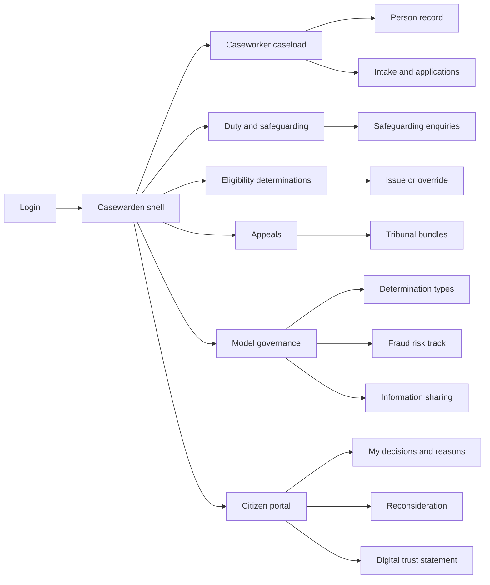
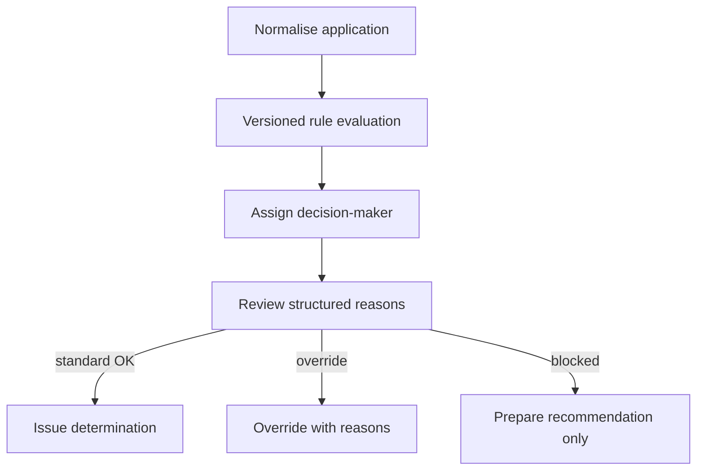
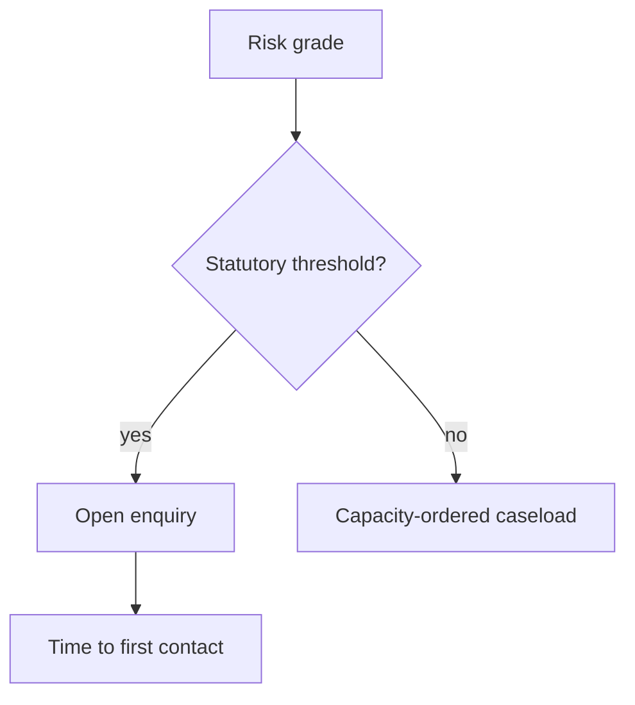

# Casewarden — Web app

**Product:** [PRODUCT.md](./PRODUCT.md)
**Primary surface:** Statutory casework console (caseworker + duty-desk workspace)
**Secondary surfaces:** Citizen reasons and appeal portal; partner disclosure gateway; model governance board view
**Design thesis:** Casewarden is a determination court docket, not a chatbot CRM. The UI metaphor is a sealed case file on a magistrate’s desk: every entitlement decision shows the named accountable human, the rule version, the facts relied on, and the appeal route before anything reaches a citizen. Visual language is deep navy parchment with chalk-white type and a single civic teal for issued decisions — safeguarding escalations interrupt in statutory coral that cannot be filtered away by triage score. The brand wordmark sits as a quiet seal on every issued determination and tribunal bundle so auditors know whose due-process record they are reading.

## UX research synthesis

### Category peers (best-in-class)

- **GOV.UK Design System / Notify patterns:** Reasons letters, structured decision notices, and accessible appeal language. Steal: plain-language consequence blocks and easy-read variants as first-class layouts; reject commercial “customer journey” funnels that hide statutory clocks.
- **Liquidlogic / Mosaic (adult social care):** Caseload by duty and risk, safeguarding enquiry stages, multi-agency participation. Steal: threshold-driven escalation that overrides queue sorting; reject opaque “risk heat” tiles without enquiry stage chrome.
- **ServiceNow Customer Service / Public Sector Case:** Assignment, SLA clocks, audit trails. Steal: purpose-scoped work queues and immutable activity history; reject generic ITIL ticket aesthetics for entitlement decisions.
- **Palantir Foundry (gov case work, high-trust deployments):** Evidence-linked decisions and field-level access. Steal: disclosure logs that answer subject-access without reconstruction; reject exploratory data-science workbenches as the caseworker home.

### Patterns to adopt / reject

- **Adopt:** Named decision-maker required before issue; machine-readable reasons (facts, rule version, gaps, consequence); risk-of-harm caseload ordering with hard safeguarding bypass; standard vs complex determination-type gates; override-as-model-signal (not worker performance); gateway-gated partner disclosures; fraud path visually and architecturally separate from eligibility; citizen digital trust statement.
- **Reject:** Chatbot as the primary caseworker UI; “computer says no” without reasons; fraud score auto-suspending payments; triage that can bury a statutory duty; purple AI insights panels; card grids of vanity channel metrics as the home.

### Trust, density, and workflow constraints from PRODUCT.md

Legal-effect determinations always need a named human (BR-1) and contestable reasons (BR-2). Safeguarding thresholds escalate irrespective of triage score (BR-3). Automated paths auto-revert when overturn rates breach thresholds (BR-4). Fraud scoring never alone cuts payment (BR-5). Cross-agency share is blocked without agreement/gateway/purpose (BR-7). Accessibility and advocacy needs cannot be efficiency-routed away from human contact (BR-8). Overrides feed model quality, not worker ratings (BR-10). Retention schedules differ by record class (BR-12).

## Information architecture

### Nav model

### Roles → default home

| Role | Default home | Why |
|------|--------------|-----|
| Caseworker / assessor | Caseload by risk and statutory deadline | Duty-first day (BR-3) |
| Duty-desk / safeguarding lead | Safeguarding enquiries + time-to-first-contact | Threshold duties (BR-3) |
| Eligibility / appeals officer | Determinations queue + overturn analytics | Standard vs complex paths (BR-4) |
| Information governance | Disclosure requests + field logs | Gateway enforcement (BR-7) |
| Model governance reviewer | Determination types and bias tests | Auto-revert and fraud track (BR-4, BR-5, BR-11) |
| Citizen / carer / advocate | My decisions and reasons | Contestability (BR-2, BR-8) |

### Cross-links to OpenAPI resources

| Nav area | OpenAPI tags / resources |
|----------|---------------------------|
| Person, accessibility, applications | Intake |
| Assessment, issue, override | Determinations |
| Risk assessment, caseload, assignments | Triage |
| Safeguarding enquiries | Safeguarding |
| Intervention offers | Interventions |
| Appeals, bundles | Appeals |
| Disclosure requests and logs | InformationSharing |
| Fraud referrals | FraudRisk |
| Determination types, bias tests | Governance |
| Service performance, digital trust | Reporting |

## Screen inventory

### Caseworker caseload

- **Purpose:** Order work by risk of harm and statutory deadline — not date received.
- **Entry:** Caseworker login default.
- **Layout regions:** Brand + team capacity; sorted case list (risk grade, deadline clock, accessibility flag); hard-escalation pin row that cannot be filtered out; alerts for evidence gaps.
- **Primary actions:** Open person; accept assignment; reallocate within team.
- **Empty / loading / error:** Empty = healthy duty desk message; loading = skeleton rows with clocks; error = retry with request id.
- **BR / story ties:** BR-3, BR-8; caseworker stories.

### Person record and intake

- **Purpose:** Single purpose-scoped view of circumstances, evidence, partner shares, and accessibility/advocacy needs.
- **Entry:** Caseload row; referral deep link.
- **Layout regions:** Identity and capacity banner; circumstance timeline; evidence tray; lawful-basis chips; accessibility/advocate panel; partner disclosure summary (gateway-limited).
- **Primary actions:** Add evidence; open application; request disclosure; flag accessibility need.
- **Empty / loading / error:** Missing lawful basis = block sensitive fields; suppressed partner fields show gateway reason.
- **BR / story ties:** BR-7, BR-8.

### Determination workspace

- **Purpose:** Prepare or issue eligibility/entitlement with structured reasons; require named decision-maker.
- **Entry:** Application → assessment; eligibility queue.
- **Layout regions:** Rule version and determination type (standard/complex); facts relied on; evidence gaps; proposed consequence; decision-maker assignment; issue / prepare / override controls.
- **Primary actions:** Assign self as decision-maker; issue; override with reasons; send notice.
- **Empty / loading / error:** Complex type = engine may only prepare; standard type with breached overturn = auto-reverted to human-only banner.
- **BR / story ties:** BR-1, BR-2, BR-4, BR-10.

### Override and model signal

- **Purpose:** Record overrides as quality feedback on the model, explicitly not worker performance.
- **Entry:** Determination workspace override action.
- **Layout regions:** Diff of engine vs override; reason codes; model-signal confirmation copy; link to determination-type monitoring.
- **Primary actions:** Submit override; view type overturn trend.
- **Empty / loading / error:** Validation requires free-text reason sufficient for appeal.
- **BR / story ties:** BR-10.

### Risk triage and assignment

- **Purpose:** Grade risk of harm and entitlement-error exposure; allocate against capacity; never extinguish statutory duty.
- **Entry:** Duty home; new intake.
- **Layout regions:** Grade controls; statutory threshold checklist; capacity heat for team; previous grades preserved on re-grade.
- **Primary actions:** Grade; escalate; assign; re-grade with history.
- **Empty / loading / error:** Threshold crossed = forced enquiry path regardless of score.
- **BR / story ties:** BR-3.

### Safeguarding enquiry board

- **Purpose:** Track enquiry stages, multi-agency participation, and time to first contact against target.
- **Entry:** Duty default; threshold escalation.
- **Layout regions:** Enquiry kanban/stages; deadline clocks; partner participants; outcome closure with preserved prior grades.
- **Primary actions:** Open enquiry; log contact; invite partner within gateway; close with outcome.
- **Empty / loading / error:** Empty = no open enquiries (with residual triage count); breach clocks = coral live region.
- **BR / story ties:** BR-3; safeguarding lead stories.

### Appeals and tribunal bundles

- **Purpose:** Meet reconsideration deadlines by assembling bundles from the determination record without reconstruction.
- **Entry:** Appeals nav; citizen lodgement.
- **Layout regions:** Appeal queue with statutory clocks; bundle preview (reasons, evidence, rule version, decision-maker); overturn analytics by type/version.
- **Primary actions:** Generate bundle; lodge outcome; flag systematic error pattern.
- **Empty / loading / error:** Incomplete record = block generate with missing-field list.
- **BR / story ties:** BR-2, BR-4; appeals officer stories.

### Disclosure gateway

- **Purpose:** Block shares unless agreement, legal gateway, and purpose exist; log at field level.
- **Entry:** Person record; IG home.
- **Layout regions:** Standing agreements; request form; field picker; grant/refuse; disclosure log timeline.
- **Primary actions:** Request; approve; refuse; export SAR log.
- **Empty / loading / error:** No gateway = hard fail with policy link — never soft-allow.
- **BR / story ties:** BR-7.

### Fraud risk track (separate)

- **Purpose:** Score referrals for human investigation only; never auto-suspend payment from score alone; bias-test on schedule.
- **Entry:** Governance / fraud investigator role — visually distinct shell accent.
- **Layout regions:** Referral queue; investigation workspace; payment-action gate requiring investigation complete; bias-test schedule and results; citizen-disclosable explanation.
- **Primary actions:** Open investigation; clear/refer; publish bias test; disclose score explanation on request.
- **Empty / loading / error:** Attempted payment action from score = blocked with BR-5 explanation.
- **BR / story ties:** BR-5, BR-11.

### Intervention offers (proactive)

- **Purpose:** Life-event outreach that is opt-out-able and explainable — not covert monitoring.
- **Entry:** Signal-driven tasks; citizen preferences.
- **Layout regions:** Signal source; offer copy; opt-out control; “why we contacted you” record.
- **Primary actions:** Send offer; record response; honour opt-out globally.
- **Empty / loading / error:** Opted out = no contact attempt; missing signal provenance = block send.
- **BR / story ties:** BR-6.

### Model governance board

- **Purpose:** Inventory models, classify determination types, set overturn thresholds, approve/withdraw, publish digital trust statement.
- **Entry:** Governance role home.
- **Layout regions:** Model inventory; determination-type table (accuracy, overturn, auto-revert state); bias-test calendar; citizen trust statement editor.
- **Primary actions:** Classify type; set threshold; withdraw model; publish trust statement.
- **Empty / loading / error:** Live automation without classification = coral compliance banner.
- **BR / story ties:** BR-4, BR-11.

### Citizen decisions and reasons

- **Purpose:** Show when automation was involved, reasons contestable in plain/easy-read language, and appeal route.
- **Entry:** Citizen/carer/advocate login; notice deep link.
- **Layout regions:** Decision summary; reasons (facts, rule, consequence); automation disclosure; advocate authority; reconsideration CTA; trust statement link.
- **Primary actions:** Request reconsideration; download reasons; manage opt-outs; appoint advocate.
- **Empty / loading / error:** Pending determination = status without premature reasons; accessibility formats offered up front.
- **BR / story ties:** BR-1, BR-2, BR-6, BR-8.
- **Mobile notes:** Reasons and appeal must be usable on phone; bundle download can defer.

### Service performance report

- **Purpose:** Evidence speed vs baseline and hours redirected from standard admin to high-risk casework.
- **Entry:** Leadership / finance.
- **Layout regions:** Speed chart vs stated baseline; hour reallocation; overturn rates; safeguarding breaches.
- **Primary actions:** Export statutory return slice; pin to trust board pack.
- **Empty / loading / error:** No baseline configured = prompt setup (BR-9).
- **BR / story ties:** BR-9.

## Key flows

1. **Issue standard determination** — intake → rule evaluation → assign named decision-maker → review reasons → issue notice; failure: no decision-maker or complex type → prepare only (BR-1, BR-4).

2. **Safeguarding hard escalation** — triage grades case → threshold checklist fails/passes → enquiry opens regardless of score → first-contact clock starts (BR-3).

3. **Reconsideration bundle** — appeal lodged → assemble from determination record → meet deadline → record overturn → feed type monitoring (BR-2, BR-4).

4. **Gateway disclosure** — request fields → check agreement/gateway/purpose → grant/refuse → field-level log (BR-7).

5. **Fraud referral without payment cut** — score → human investigation → only then payment action path; bias test on schedule (BR-5).

## Design system

### Tokens (CSS variables)

- `--color-ink: #F2F4F7` — primary text
- `--color-ground: #0B1524` — deep navy ground
- `--color-panel: #132033` — case file panels
- `--color-rule: #2C3E55` — dividers
- `--color-teal: #2BB5A0` — issued determination / accountable seal
- `--color-teal-dim: #1A6B5E` — teal on dark
- `--color-amber: #D9A441` — evidence gap / pending reconsideration
- `--color-coral: #E05A4F` — safeguarding threshold / statutory breach
- `--color-steel: #8A9BB0` — secondary labels
- `--color-brand: #9BC9BE` — Casewarden seal accent
- `--color-fraud-rail: #3A2A32` — distinct fraud-track panel tint (never mixed into eligibility chrome)
- `--font-display: "Source Serif 4", serif` — determination titles and citizen notices (civic, not cream-terracotta marketing)
- `--font-body: "IBM Plex Sans", sans-serif` — console body
- `--font-mono: "IBM Plex Mono", monospace` — rule versions, gateway ids, bundle hashes
- `--space-1`…`--space-8`: 4px scale
- `--radius-sm: 2px`; `--radius-md: 6px` — file-sharp, not soft SaaS
- `--motion-issue: 200ms ease-out` — seal stamp on issue
- `--motion-escalation: 160ms ease-in` — coral threshold interrupt
- `--motion-clock: 300ms linear` — deadline urgency pulse near breach
- Atmosphere: subtle paper-grain on determination panels; navy vignette; no stock “helping hands” photography in console.

### Typography & brand

- Serif display for issued decision titles and citizen-facing reasons headers; sans for queues; mono for rule versions and disclosure ids.
- Brand seal left of shell on determination, appeal, and trust surfaces; never a generic “Dashboard” as the hero mark.
- Citizen login: brand as hero; one headline (“Decisions you can challenge”); one CTA — no channel-stat strips.

### Do / don’t

- **Do:** Require named decision-maker before issue; show rule version on every reason; hard-pin safeguarding rows; separate fraud chrome; treat overrides as model signals; honour easy-read and advocate modes.
- **Don’t:** Purple AI glow; auto-suspend from fraud score; bury threshold cases under triage filters; chat-first casework home; emoji status; card grids of vanity bot deflection rates as the primary surface.

### Accessibility & domain trust cues

- WCAG AA+; easy-read and interpreter flags change layout density, not just a badge.
- Live regions for safeguarding clocks and appeal deadlines.
- Focus order: intake → reasons → decision-maker → issue → appeal.
- Digital trust statement is citizen-readable and linked from every notice.

## Component patterns

- **DeterminationReasonBlock** — facts, rule version, gaps, consequence.
- **AccountableDecisionMakerBar** — required named human before issue.
- **SafeguardingThresholdPin** — non-dismissible escalation row.
- **CaseloadDutyClock** — statutory deadline with breach state.
- **OverrideModelSignal** — override form that credits model quality.
- **DisclosureGatewayGate** — agreement + purpose + field picker.
- **FraudTrackShell** — visually segregated investigation chrome.
- **TribunalBundleExport** — one-click assembly from append-only history.
- **AccessibilityNeedBanner** — blocks efficiency-only deflection from human contact.
- **DigitalTrustStatement** — published automation disclosure for citizens.

## Out of scope for v1 web

- Full virtual-adviser NLP training studio; national multi-jurisdiction federation; payments ledger replacement; clinical EHR; police RMS; native mobile caseworker apps beyond responsive duty triage; white-label chatbot marketplaces.
